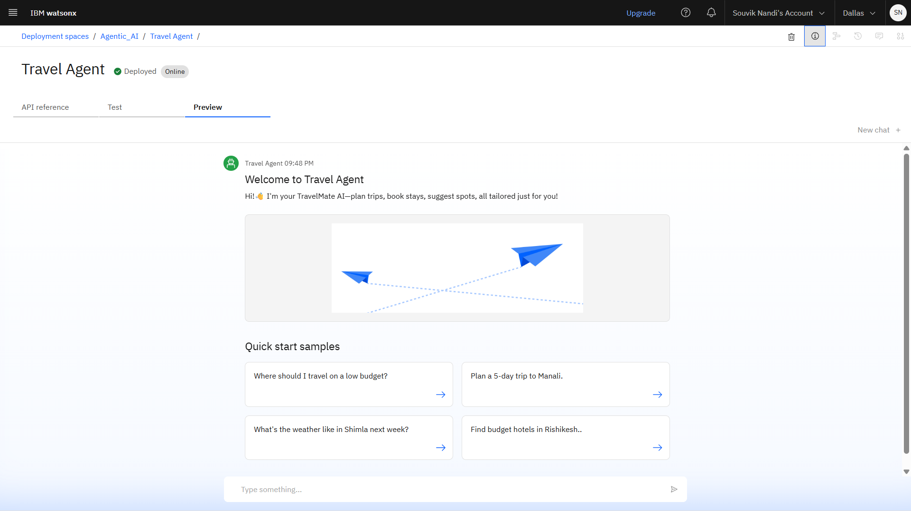

  
  &nbsp;&nbsp;&nbsp;
  

# 🌍 TravelMate AI

TravelMate AI is an AI-powered Travel Planner Agent that uses **Natural Language Processing (NLP)** and **Retrieval-Augmented Generation (RAG)** to assist users in generating personalized travel plans. It interacts naturally with users, understands their preferences, and fetches real-time travel data to recommend destinations, build itineraries, and optimize travel schedules seamlessly.

 
---

## 🚀 Features

- Conversational travel planning with NLP
- Personalized trip recommendations
- Real-time travel data fetching
- Dynamic itinerary creation
- Budget-friendly travel suggestions
- Interactive UI with quick start samples

---

## 🛠️ Technologies Used

- **IBM Cloud Lite Services** – Hosting and deployment environment
- **Natural Language Processing (NLP)** – For user input understanding
- **Retrieval-Augmented Generation (RAG)** – Enhancing response with real-time data
- **IBM Granite Model** – Open-weight LLM for human-like responses

---

## ☁️ IBM Cloud Services Used

| Service                          | Description                                                                 |
|----------------------------------|-----------------------------------------------------------------------------|
| **Watsonx AI Studio**           | Collaborative development for AI agent building & testing                   |
| **Watsonx AI Runtime**          | Runtime environment to deploy and execute AI models in real-time           |
| **IBM Cloud Agent Lab**         | Visual interface for workflow and agent logic creation                     |
| **Granite Foundation Model**    | Powerful LLM (`granite-3-36-8b-instruct`) for advanced language processing |

---

## 🔮 Future Scope

- 🌐 **Multilingual Support** – Expand to support users in multiple languages  
- 🎙️ **Voice-Activated Assistant** – Enable voice input for hands-free travel planning  
- 📱 **Mobile App Integration** – Extend services into Android/iOS platforms  
- 📍 **Location-Based Recommendations** – GPS-enabled dynamic suggestions  
- 📥 **Offline Mode** – Travel guidance even with low or no internet access  
- ✈️ **Flight & Hotel Booking Integration** – Real-time booking capabilities  
- 🧠 **Smart Budget Estimation** – Personalized trip budgeting using AI prediction models  

---

## 📄 Project Presentation

Click below to view or download the official TravelMate AI project presentation (`.pptx`):

👉 [📥TravelMate Presentation File](./Project-ppt/TravelMate.pptx)

--]

## 🙏 Special Thanks To

  
  &nbsp;&nbsp;&nbsp;
  
  &nbsp;&nbsp;&nbsp;
  

Special thanks to **IBM**, **IBM Cloud**, and **Edunet Foundation** for providing tools, guidance, and resources that made this project possible.

Special mention to [Aswini Kumar Motapothula](https://www.linkedin.com/in/aswini-kumar-motapothula) Sir for mentorship and valuable guidance throughout the project.

---

## 👨‍💻 Developed By

 [Souvik Nandi](https://www.linkedin.com/in/souvik-nandi-560b15260)  
B.Tech in Electronics and Communication Engineering (2022–26)  
[Ramkrishna Mahato Government Engineering College (RKMGEC)](https://rkmgec.ac.in)  

---

> “TravelMate AI isn't just a planner—it's your smart travel companion.”
